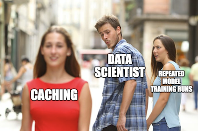

Data is the lifeblood that feeds machine learning models. The process of developing those models requires data in different forms. During the early lifecycle stages of any particular model, particularly when experimenting with different approaches, this data will get used repeatedly.

Machine learning model development is extremely iterative in this way. Data scientists are constantly repeating steps in slightly different combinations. Given that data often is imported or transformed in the course of these steps, it would be good to find a way to minimise wasted work. Luckily, we can use caching to save the day.

If we organise the steps of our model training smartly, we can ensure that the data outputs and inputs along the way are cached. A good way to think about splitting up the steps is to use the image of [pipelines](https://blog.zenml.io/tag/pipelines/) and the steps that are executed. For each step, data is passed in, and (potentially) gets returned. We can cache the data at these entry and exit points. If we rerun the pipeline we will only rerun an individual step if something has changed in the implementation, otherwise we can just use the cached output value.

## Benefits of Caching

I hope it is clear how 

## Get caching for free with ZenML pipelines

## Plug

If you like the thoughts here, we’d love to hear your feedback on ZenML. It is [open-source](https://github.com/maiot-io/zenml) and we are looking for early adopters and [contributors](https://github.com/maiot-io/zenml)! And if you find it is the right order of abstraction for you/your data scientists, then let us know as well via [our Slack](http://zenml.io/slack-invite) — looking forward to hearing from you!

[Photo by [Juliana Kozoski](https://unsplash.com/@jkozoski?utm_source=unsplash&utm_medium=referral&utm_content=creditCopyText) on [Unsplash](https://unsplash.com/s/photos/pipes?utm_source=unsplash&utm_medium=referral&utm_content=creditCopyText)]