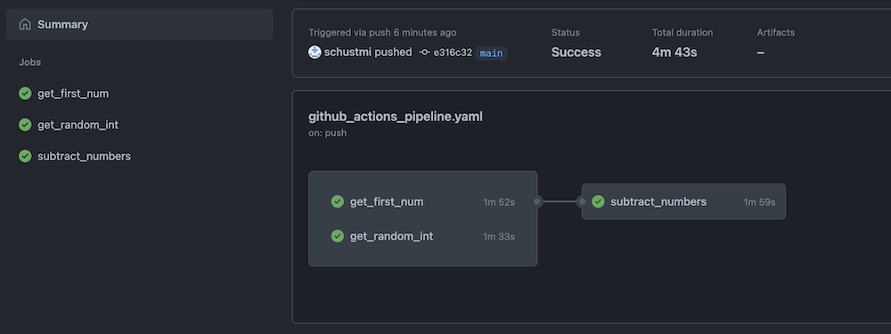
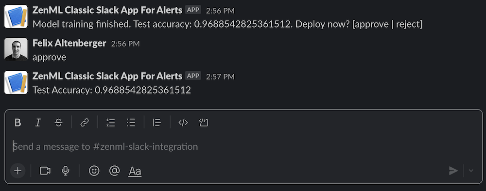

It's been a couple of weeks, so it's time for a new release! 0.9.0 brings two whole new orchestrators, one of which was contributed by a community member just one day after we unveiled new documentation for orchestrator extensibility! The release also includes a new secrets manager, a Slack integration and a bunch of other smaller changes across the codebase. (Our new orchestrators are exciting enough that they'll get their own blog posts to showcase their strengths in due course.)

Beyond this, as usual we included a number of smaller bugfixes and documentation changes to cumulatively improve experience of using ZenML as a user. For a detailed look at what's changed, give [our full release notes](https://github.com/zenml-io/zenml/releases/tag/0.9.0) a glance.

## 🤯 Github Actions as Orchestrator

Who says you need complicated infrastructure setup to run your pipeline? Just use GitHub Actions. With [this new addition](https://github.com/zenml-io/zenml/pull/685) to ZenML's ever-growing list of built-in orchestrators, you can run your pipelines using GitHub Actions to manage the dependencies between steps.

You wouldn't want your secrets floating around openly in your code commits, so we made sure to integrate with [the way GitHub stores secrets](https://docs.github.com/en/actions/security-guides/encrypted-secrets) as encrypted environment variables.

Needless to say, the GitHub Actions orchestrator is an exciting new addition to ZenML that will help you get going with your deployed pipelines even faster. [Let us know](https://zenml.io/slack-invite/) if you are excited by this new integration!

## ☁ Vertex AI Orchestrator: To Google and Beyond!

We previously added a way to run individual steps on [Vertex AI](https://cloud.google.com/vertex-ai) as step operators. One of our amazing community members, [Gabriel Martín Blázquez](https://github.com/gabrielmbmb), has [added a way](https://github.com/zenml-io/zenml/pull/640) to orchestrate your entire pipelines using Vertex AI Pipelines.

The most exciting thing about this new orchestrator is that it came as a direct result of our documentation and extensibility improvements in [our last release](https://blog.zenml.io/zero-eight-zero-release/). We look forward to seeing what other integrations users add to their stacks…

## 🍏 Fruits of the ZenHack Day: Slack Alerters and Azure Secrets Manager

[Our community-focused ZenHack day](https://youtu.be/8qb5IABTZ-s) included a number of features that were implemented alongside one another. Among those was a [ChatOps](https://www.atlassian.com/blog/software-teams/what-is-chatops-adoption-guide)-inspired Alerter component, with Slack as its first inbuilt implementation.

You can now define interfaces where you can interact with and make decisions around how your steps get executed through Slack commands. Because seriously, who'd rather do this in the terminal when you can get a friendly Slack ping instead?

We also [implemented an Azure Secrets Manager](https://github.com/zenml-io/zenml/pull/654) integration, completing our cloud secrets manager coverage. We've got a cloud-agnostic implementation of this in the works, but more about that next release!

## ⌨️ CLI Improvements

Barely a release passes without some user-facing CLI improvements, and this one is no exception. We added two small changes that just might bring a bit of UI 🌞 to your day:

- If you want to register a stack component but aren't sure exactly which attributes to register for your particular component, we [added an interactive CLI flow](https://github.com/zenml-io/zenml/pull/695) that guides you through everything you need to include.

- We previously added the ability to update a pre-existing stack in place, but sometimes you want to duplicate a stack and make a slight modification to one you already configured. In this release we've given you that option with the easy `zenml stack copy` command.

## 📖 Documentation & User Guides

User-facing documentation is really important for us at ZenML, and we keep our main documentation page up-to-date. With the latest release, we've made sure we're just as consistent with the internal code documentation in the form of docstrings. We've added CI checks using [`pydocstyle`](http://www.pydocstyle.org/en/stable/) and [`darglint`](https://github.com/terrencepreilly/darglint) that ensure that all our functions and modules include correct and consistently presented docstrings.

We switched out how we check for spelling errors, too, and we're now using [`pyspelling`](https://facelessuser.github.io/pyspelling/) everywhere to make sure we stay typo-free!

This release includes a number of other smaller documentation fixes and additions.

## ➕ Other Updates, Additions and Fixes

The latest release include several smaller features and updates to existing functionality:

- Schedules can now be defined using 'cron' expressions
- The detection of whether a step was cached or not is now done without querying the metadata store. This reduces the step execution by ~10secs.
- We now allow for the passing of authentication credentials to all artifact stores and container registries as secrets
- We made the dependencies that are part of the ZenServer optional. If you wish to install the ZenServer, be sure to use the following command: `pip install zenml[server]`.
- We fixed some broken or deprecated CLI commands listed in our examples.
- We made some internal changes to how code is organized within the core `src/zenml` directory, notably for the `utils` module and for all the cloud integrations.

## 🙌 Community Contributions

We received several new community contributions during this release cycle. We mentioned Gabriel's Vertex AI orchestrator above already, but we also saw the following contributions:

* [@anencore94](https://github.com/anencore94) made their first contribution in [https://github.com/zenml-io/zenml/pull/644](https://github.com/zenml-io/zenml/pull/644)
* [@hectorLop](https://github.com/hectorLop) made their first contribution in [https://github.com/zenml-io/zenml/pull/648](https://github.com/zenml-io/zenml/pull/648)
* [@gabrielmbmb](https://github.com/gabrielmbmb) made their first contribution in [https://github.com/zenml-io/zenml/pull/640](https://github.com/zenml-io/zenml/pull/640)
* [@ketangangal](https://github.com/ketangangal) made their first contribution in [https://github.com/zenml-io/zenml/pull/628](https://github.com/zenml-io/zenml/pull/628)
* [@Reed-Schimmel](https://github.com/Reed-Schimmel) made their first contribution in [https://github.com/zenml-io/zenml/pull/684](https://github.com/zenml-io/zenml/pull/684)

## 👩‍💻 Contribute to ZenML!

Join our [Slack](https://zenml.io/slack-invite/) to let us know if you have an
idea for a feature or something you'd like to contribute to the framework.

We have a [new home for our
roadmap](https://zenml.io/roadmap) where you can vote on your favorite upcoming
feature or propose new ideas for what the core team should work on. You can vote
without needing to log in, so please do let us know what you want us to build!

[Photo by <a href="https://unsplash.com/@allisonh328">Allison Louise</a> on <a href="https://unsplash.com/photos/xABgmlX4ABE">Unsplash</a>]
