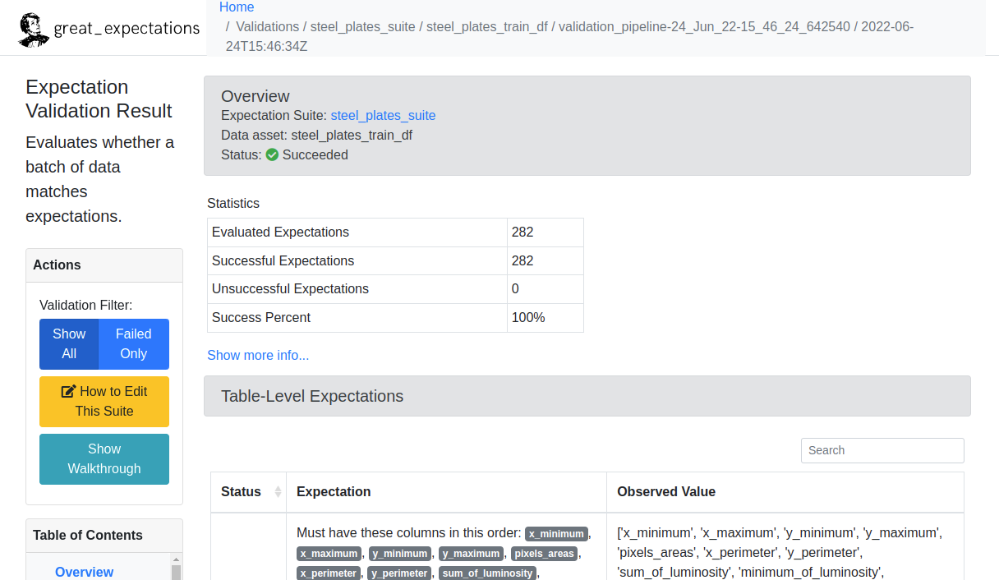

The 0.10.0 release continues our streak of extending ZenML with support for new orchestrators, this time by adding the Kubernetes Native Orchestrator. Also included are: a Data Validator stack component and Great Expectations implementation and a community-contributed Vault secret manager among a host of other things! ✨

Beyond this, as usual we included a number of smaller bugfixes and documentation changes to cumulatively improve experience of using ZenML as a user. 
For a detailed look at what's changed, give [our full release notes](https://github.com/zenml-io/zenml/releases/tag/0.10.0) a glance.

## 🛳️ Kubernetes Native Orchestrator

We've heard you! With this new addition to our increasing list of orchestrators, you can now run your ZenML pipelines natively on your Kubernetes Cluster. 

This orchestrator is a lightweight alternative to other distributed orchestrators like Airflow or Kubeflow that gives our users the ability to run pipelines in any Kubernetes cluster without having to install and manage additional tools or components.

It's amazing but don't take my word for it; try it on your own or wait for the dedicated blog post that we've planned, 
which, by the way, also features a little surprise to make it easier for you to follow along 😉

There's a lot to love about this integration.
* Every step gets executed in its own pod and the logs from all of them are streamed to your terminal!
* You can schedule pipeline runs as CRON jobs.
* It automatically spins up a MySQL metadata store for you when you do `zenml stack up`!

We can't wait to hear your thoughts on this 🙂

## 🎉 Great Expectations as the new Data Validator

Want to run data quality checks as part of a ZenML pipeline? We've got you covered!

We introduce Data Validators and The Great Expectations integration which eliminates the complexity associated with configuring the store backends for Great Expectations by reusing our Artifact Store concept for that purpose and gives ZenML users immediate access to Great Expectations in both local and cloud settings.

In addition, there are two new standard steps:

* a Great Expectations profiler that can be used to automatically generate Expectation Suites from input datasets.
* a Great Expectations validator that uses an existing Expectation Suite to validate an input dataset.

A ZenML visualizer that is tied to the generated Great Expectations data docs is also included and can be used to visualize the expectation suites and 
checkpoint results created by pipeline steps 😍

Got feedback or just want to let us know how you feel? [Connect with us](https://zenml.io/slack-invite/) or join us for a [Community Meetup](https://www.eventbrite.de/e/zenml-meet-the-community-tickets-354426688767?utm-campaign=social&utm-content=attendeeshare&utm-medium=discovery&utm-term=listing&utm-source=cp&aff=escb) 👋 which happens every Wednesday!

## 🔐 A Vault Secret Manager

To add to our growing list of secret managers, we now have a Vault integration, courtesy of one of our community members, [Karim Habouch](https://github.com/karimhabush)! We are grateful for their contribution ⭐

## ⌨️ CLI Improvements

A new release means new improvements to the CLI. We made changes to make handling stacks a bit easier 🥰:

- When registering and updating stack components through the CLI, the configuration attribute values can now also be loaded from files (by using the @path/to/file syntax).

## 📖 Documentation & User Guides

As usual, user-facing documentation is really important for us and we made a bunch of fixes and additions towards that end.

## ➕ Other Updates, Additions and Fixes

The latest release include several smaller features and updates to existing functionality:

* We fixed an error that happened if you ran MLflow deployer twice.

* We fixed some dead links in integrations docs and other guides.

* We made some fixes to the GCP artifact store implementation.

* We have replaced the alerter standard steps to slack specific alerter standard steps.

## 🙌 Community Contributions

We received several new community contributions during this release cycle. We mentioned Karim's Vault Secret Manager above already, but here's everybody who contributed towards this release:

* [@chethanuk-plutoflume](https://github.com/chethanuk-plutoflume) made their first contribution in https://github.com/zenml-io/zenml/pull/716
* [@dnth](https://github.com/dnth) made their first contribution in https://github.com/zenml-io/zenml/pull/722
* [@karimhabush](https://github.com/karimhabush) made their first contribution in https://github.com/zenml-io/zenml/pull/689

## 👩‍💻 Contribute to ZenML!

Join our [Slack](https://zenml.io/slack-invite/) to let us know if you have an
idea for a feature or something you'd like to contribute to the framework.

We have a [new home for our
roadmap](https://zenml.io/roadmap) where you can vote on your favorite upcoming
feature or propose new ideas for what the core team should work on. You can vote
without needing to log in, so please do let us know what you want us to build!

[Photo by <a href="https://unsplash.com/@ayoo_twitch">Roberto Arias</a> on <a href="https://unsplash.com/photos/5V_pMmsv7wk">Unsplash</a>]
  